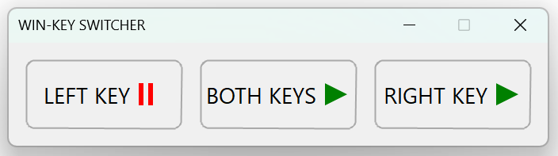

# Disable Windows Key

A tiny utility that lets you **turn off the left, right, or both Windows keys** with a single click.  
No registry edits, no scripts, no hacks — just run it and play without interruptions. 🎮



---

## Gaming?

If you’ve ever hit the Windows key by mistake in the middle of a match, you know the pain.  
This tool was built exactly for that reason: to avoid accidental desktop jumps while gaming or working.

---

## Features

- 🚫 Disable **left**, **right**, or **both** Windows keys  
- 🖱️ Super simple interface — no setup needed  
- 🎮 Perfect for gaming sessions (works with all games)  
- 💾 Lightweight & portable (no installer)  
- 🖥️ Tested on Windows 11… and I *guess* it should work on older versions too 

---

## How to Use

1. Launch the app.  
2. Select which Windows key(s) you want to disable.  
3. Done — play without worrying about accidental presses.  
4. Close the app to restore normal behavior.  


---

## Download

👉 [**Download EXE — see all releases here**](https://github.com/oleksiivasylenko/windows-key-switcher/releases)

Each release contains the following in the **Assets** section:

- `WinKeySwitcher-<version>-win-x64-sc.exe` → 64-bit **self-contained** build (includes .NET runtime)  
- `WinKeySwitcher-<version>-win-x64-fdd.exe` → 64-bit **framework-dependent** build (requires .NET 9 installed)  

### Which one should I choose?

- ✅ **If you’re not sure** → grab the **64-bit self-contained** (`-x64-sc.exe`) — it works everywhere without extra dependencies.  
- The **FDD (framework-dependent)** build is a smaller download but requires that you already have the **.NET 9 runtime** installed on your system.  
- Use **x64** builds on 64-bit Windows (recomended).  
- Use **x86** builds only if you specifically need 32-bit.
---

## Verify Integrity (SHA-256)

After downloading, you can verify that the executable is authentic and hasn’t been tampered with.  
On each release page, GitHub shows a **SHA-256 checksum** for every file (click the *Copy SHA256* button).

**Windows (PowerShell):**
```powershell
Get-FileHash .\WinKeySwitcher-<version>-win-<platform>-<cs/fdd>.exe -Algorithm SHA256

# <version> & <platform> & <sc/fdd> → take these parts exactly as they appear in the downloaded file name

# The output hash must match the value you copied from the GitHub release page.
```

## License

This project is released under the **MIT License**.  
Free to use, modify, and share.
